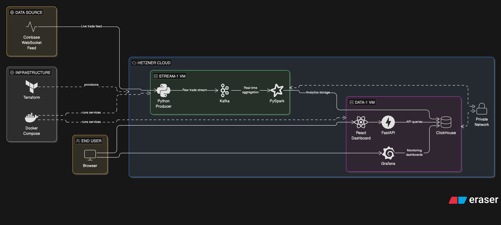
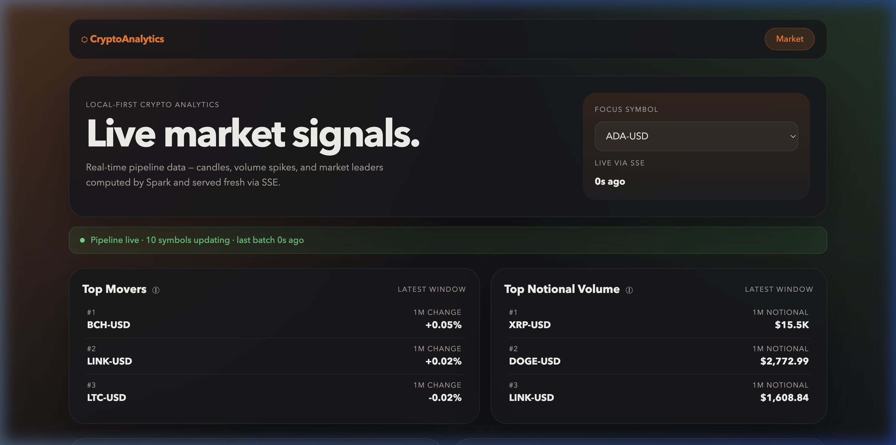
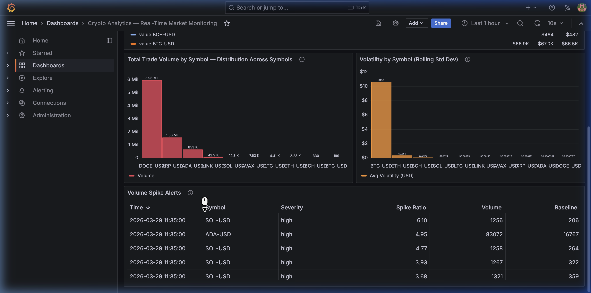

# Enterprise Crypto Analytics

Cloud-first real-time crypto analytics pipeline for Data Engineering Zoomcamp.

This repository is intentionally structured around the cloud submission path:

- Hetzner Cloud
- Terraform
- Kafka
- PySpark Structured Streaming
- ClickHouse
- FastAPI
- React
- Grafana

## Architecture

```text
Coinbase WebSocket
  -> Python Producer
  -> Kafka (KRaft)
  -> PySpark Structured Streaming
  -> ClickHouse
  -> FastAPI + React Dashboard
  -> Grafana
```

Cloud deployment uses 2 Hetzner VMs:

- `stream-1`: producer, Kafka, Spark
- `data-1`: ClickHouse, API, React build, Grafana, Caddy



## Product Screenshots

React dashboard showing live market monitoring, symbol analytics, and alerting:



Grafana dashboard showing ClickHouse-backed operational analytics:



## Repository Layout

```text
apps/dashboard/frontend/      React frontend
images/                       Submission screenshots
infra/cloud/                  Cloud deployment assets
src/crypto_analytics/         Shared application code
```

## Prerequisites

- Terraform `>= 1.5`
- Docker + Docker Compose v2 on your local machine
- Node.js + npm
- Hetzner Cloud account
- SSH key already registered in Hetzner

## Step 1. Provision Infrastructure

```bash
cd infra/cloud/terraform
cp terraform.tfvars.example terraform.tfvars
```

Fill in:

- `hcloud_token`
- `existing_ssh_key_name`
- `location`
- `domain`

Then run:

```bash
terraform init
terraform validate
terraform plan
terraform apply
```

Get the VM IPs:

```bash
terraform output
```

## Step 2. Generate Kafka Cluster ID

```bash
docker run --rm apache/kafka:3.7.1 \
  /opt/kafka/bin/kafka-storage.sh random-uuid
```

## Step 3. Prepare Cloud Environment File

From the repository root:

```bash
cp infra/cloud/.env.cloud.example infra/cloud/.env.cloud
```

Update:

- `PUBLIC_BASE_URL=http://<DATA_VM_PUBLIC_IP>`
- `KAFKA_CLUSTER_ID=<generated uuid>`
- `CLICKHOUSE_PASSWORD=<strong password>`
- `GRAFANA_ADMIN_PASSWORD=<strong password>`

For first deploy, keep:

```bash
SITE_ADDRESS=:80
```

Do not commit:

- `infra/cloud/.env.cloud`
- `infra/cloud/terraform/terraform.tfvars`

## Step 4. Build Frontend

```bash
cd apps/dashboard/frontend
npm install
npm run build
cd /Users/myatkaung/Desktop/MK_Data_Engineering/DataEngineering/enterprise-crypto-analytics
```

## Step 5. Deploy stream-1

```bash
STREAM_IP=$(terraform -chdir=infra/cloud/terraform output -raw stream_1_public_ip)
```

Sync the required files:

```bash
rsync -avR \
  ./requirements.txt \
  ./pyproject.toml \
  ./README.md \
  ./src \
  ./infra/cloud/.env.cloud \
  ./infra/cloud/stream-1 \
  root@$STREAM_IP:/opt/crypto-analytics/
```

Start services:

```bash
ssh root@$STREAM_IP
cd /opt/crypto-analytics
docker compose --env-file infra/cloud/.env.cloud -f infra/cloud/stream-1/docker-compose.yml up -d --build
docker compose --env-file infra/cloud/.env.cloud -f infra/cloud/stream-1/docker-compose.yml ps
exit
```

## Step 6. Deploy data-1

```bash
DATA_IP=$(terraform -chdir=infra/cloud/terraform output -raw data_1_public_ip)
```

Sync the required files:

```bash
rsync -avR \
  ./requirements.txt \
  ./pyproject.toml \
  ./README.md \
  ./src \
  ./apps/dashboard/frontend/dist \
  ./infra/cloud/.env.cloud \
  ./infra/cloud/clickhouse \
  ./infra/cloud/data-1 \
  root@$DATA_IP:/opt/crypto-analytics/
```

Start services:

```bash
ssh root@$DATA_IP
cd /opt/crypto-analytics
docker compose --env-file infra/cloud/.env.cloud -f infra/cloud/data-1/docker-compose.yml up -d --build
docker compose --env-file infra/cloud/.env.cloud -f infra/cloud/data-1/docker-compose.yml ps
exit
```

## Step 7. Verify

```bash
curl http://$DATA_IP/api/health
```

Open:

- `http://<DATA_VM_PUBLIC_IP>/`
- `http://<DATA_VM_PUBLIC_IP>/grafana`

Grafana login:

- username: `admin`
- password: `GRAFANA_ADMIN_PASSWORD`

Optional ClickHouse checks on `data-1`:

```bash
docker exec -it clickhouse clickhouse-client --query "SELECT count() FROM crypto.raw_trades"
docker exec -it clickhouse clickhouse-client --query "SELECT count() FROM crypto.live_metrics"
docker exec -it clickhouse clickhouse-client --query "SELECT count() FROM crypto.candles_1m"
```

## Troubleshooting

On `stream-1`:

```bash
docker compose --env-file infra/cloud/.env.cloud -f infra/cloud/stream-1/docker-compose.yml ps
docker compose --env-file infra/cloud/.env.cloud -f infra/cloud/stream-1/docker-compose.yml logs --tail=100 producer
docker compose --env-file infra/cloud/.env.cloud -f infra/cloud/stream-1/docker-compose.yml logs --tail=200 spark
```

On `data-1`:

```bash
docker compose --env-file infra/cloud/.env.cloud -f infra/cloud/data-1/docker-compose.yml ps
docker compose --env-file infra/cloud/.env.cloud -f infra/cloud/data-1/docker-compose.yml logs --tail=100 api
docker compose --env-file infra/cloud/.env.cloud -f infra/cloud/data-1/docker-compose.yml logs --tail=100 grafana
docker compose --env-file infra/cloud/.env.cloud -f infra/cloud/data-1/docker-compose.yml logs --tail=100 caddy
```

## More Detail

For a longer cloud operations guide, see
[DEPLOY.md](/Users/myatkaung/Desktop/MK_Data_Engineering/DataEngineering/enterprise-crypto-analytics/infra/cloud/DEPLOY.md).
