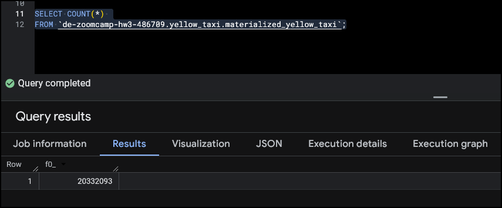
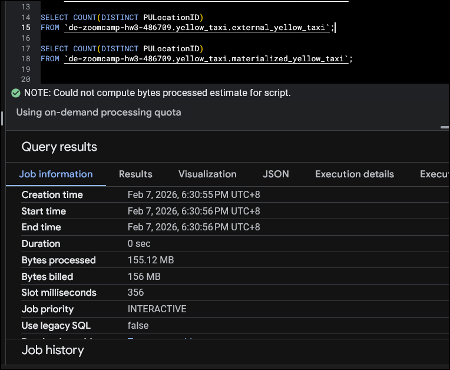
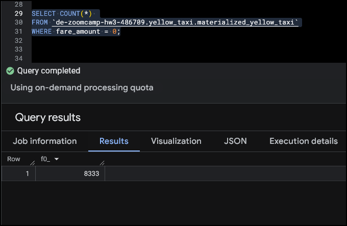
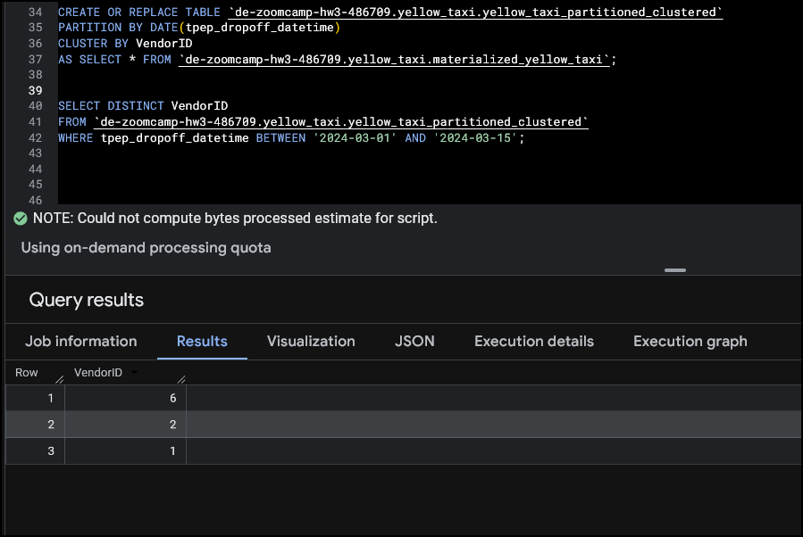

# Module 3 Homework: BigQuery & Data Warehousing


**Note: I used BigQuery for all these questions.**

## Project Info
- **Project ID**: de-zoomcamp-hw3-486709
- **Bucket**: de-zoomcamp-hw3-yellow-taxi
- **Dataset**: `yellow_taxi` (created in BigQuery, location: us-central1)

## Setup

### Create External Table
```sql
CREATE OR REPLACE EXTERNAL TABLE `de-zoomcamp-hw3-486709.yellow_taxi.external_yellow_taxi`
OPTIONS (
  format = 'PARQUET',
  uris = ['gs://de-zoomcamp-hw3-yellow-taxi/yellow_taxi/yellow_tripdata_2024-*.parquet']
);
```

### Create Materialized Table
```sql
CREATE OR REPLACE TABLE `de-zoomcamp-hw3-486709.yellow_taxi.materialized_yellow_taxi`
AS SELECT * FROM `de-zoomcamp-hw3-486709.yellow_taxi.external_yellow_taxi`;
```

## Question 1: Count of records

**Expected Answer**: 20,332,093



```sql
SELECT COUNT(*) 
FROM `de-zoomcamp-hw3-486709.yellow_taxi.materialized_yellow_taxi`;
```

## Question 2: Distinct PULocationID - Estimated Bytes

**Expected Answer**: 0 MB for External Table and 155.12 MB for Materialized Table



```sql
-- Run this FIRST, note the estimated bytes (External Table)
SELECT COUNT(DISTINCT PULocationID) 
FROM `de-zoomcamp-hw3-486709.yellow_taxi.external_yellow_taxi`;
-- BigQuery CANNOT estimate bytes for external tables → shows 0 MB

-- Run this SECOND, note the estimated bytes (Materialized Table)
SELECT COUNT(DISTINCT PULocationID) 
FROM `de-zoomcamp-hw3-486709.yellow_taxi.materialized_yellow_taxi`;
-- BigQuery CAN estimate bytes for materialized tables → shows ~155.12 MB
```

## Question 3: Why are estimated bytes different for 1 vs 2 columns?

**Answer**: BigQuery is COLUMNAR — it only reads the columns you ask for.

```sql
-- Query A: ONE column (check estimated bytes)
SELECT PULocationID 
FROM `de-zoomcamp-hw3-486709.yellow_taxi.materialized_yellow_taxi`;
-- Estimated: ~155 MB (reads 1 column)

-- Query B: TWO columns (check estimated bytes)
SELECT PULocationID, DOLocationID 
FROM `de-zoomcamp-hw3-486709.yellow_taxi.materialized_yellow_taxi`;
-- Estimated: ~310 MB (reads 2 columns, roughly double!)
```

## Question 4: Count of zero fare trips

**Expected Answer**: 128,210



```sql
-- EFFICIENT: Only scans fare_amount column
SELECT COUNT(*) 
FROM `de-zoomcamp-hw3-486709.yellow_taxi.materialized_yellow_taxi`
WHERE fare_amount = 0;
```

## Question 5: Best partitioning/clustering strategy

**Answer**: Partition by tpep_dropoff_datetime, Cluster by VendorID

```sql
CREATE OR REPLACE TABLE `de-zoomcamp-hw3-486709.yellow_taxi.yellow_taxi_partitioned_clustered`
PARTITION BY DATE(tpep_dropoff_datetime)
CLUSTER BY VendorID
AS SELECT * FROM `de-zoomcamp-hw3-486709.yellow_taxi.materialized_yellow_taxi`;
```

## Question 6: Compare non-partitioned vs partitioned table

**Expected Answer**: ~310.24 MB for non-partitioned and ~26.84 MB for partitioned



```sql
-- INEFFICIENT: Non-partitioned table (scans entire table for date range)
SELECT DISTINCT VendorID 
FROM `de-zoomcamp-hw3-486709.yellow_taxi.materialized_yellow_taxi`
WHERE tpep_dropoff_datetime BETWEEN '2024-03-01' AND '2024-03-15';
-- Estimated: ~310 MB (scans ALL data, then filters)

-- EFFICIENT: Partitioned table (only scans March 1-15 partitions)
SELECT DISTINCT VendorID 
FROM `de-zoomcamp-hw3-486709.yellow_taxi.yellow_taxi_partitioned_clustered`
WHERE tpep_dropoff_datetime BETWEEN '2024-03-01' AND '2024-03-15';
-- Estimated: ~26 MB (skips all data outside March 1-15!)
```

## Question 7: Where is External Table data stored?

**Answer**: GCP Bucket (The external table is just a pointer to files in your GCS bucket)

## Question 8: Should you ALWAYS cluster?

**Answer**: FALSE

Clustering is NOT always best because:
• Tables smaller than 1 GB see no benefit
• Clustering adds overhead during data ingestion
• If queries don't filter/order on cluster columns, it's wasted
• Adds maintenance complexity

## Question 9 (Bonus): SELECT COUNT(*) estimated bytes

```sql
SELECT COUNT(*) 
FROM `de-zoomcamp-hw3-486709.yellow_taxi.materialized_yellow_taxi`;
-- Estimated bytes: 0 bytes!
```

## Summary of Optimization Patterns

| Inefficient ❌ | Efficient ✅ |
|---------------|-------------|
| SELECT * | SELECT only_needed_columns |
| Query external table | Query materialized table |
| Non-partitioned + date filter | Partitioned by date + filter |
| No clustering + ORDER BY | Clustered on ORDER BY column |
| WHERE on non-partitioned column | WHERE on partition column |
